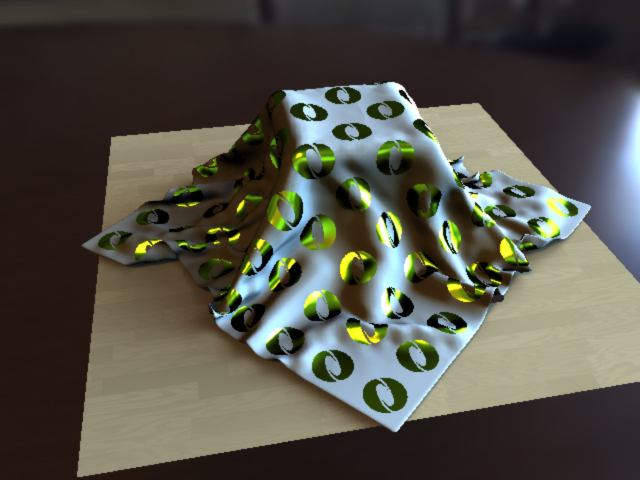
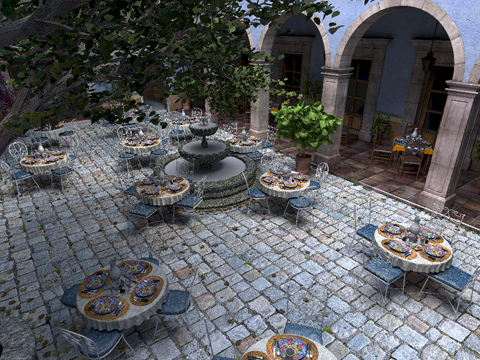
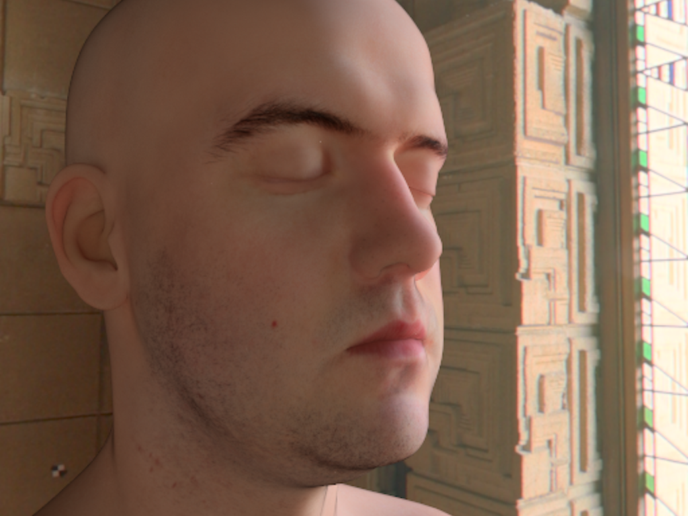
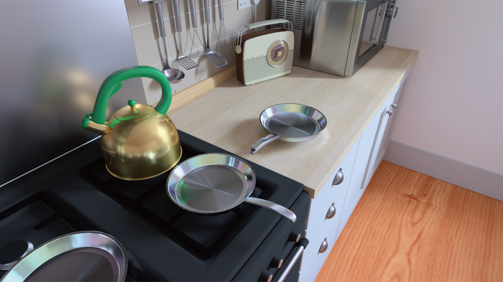

<link rel="stylesheet" href="https://cdn.jsdelivr.net/bxslider/4.2.12/jquery.bxslider.css">

Visual Computing Laboratory (VCL) mainly focuses on developing new algorithms for Computer Graphics. 
Research topics include rendering (real-time and off-line), physically-based visual simulation, animation, and fabrication.

#### For Prospective Students
We are always looking for highly-motivated PhD students working with us.
If you are interested in joining our lab, please let me know via e-mail (keiiwasaki[atmark]acm.org).

Currently, our lab does not accept research students (kenkyu-sei/研究生) due to the limited resource.

### News
- 2025/04/29: We have one paper accepted by SIGGRAPH 2025 Technical Paper (Conference Track). 
- 2025/04/10: We have one short paper accepted by Eurographics 2025.
- 2024/06/05: We have two papers presented at Graphics Interface 2024.
- 2024/03/25: We have renewed our website.

###

