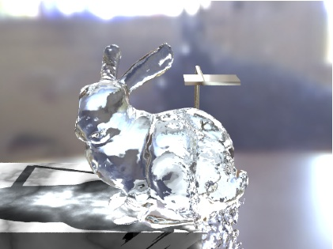
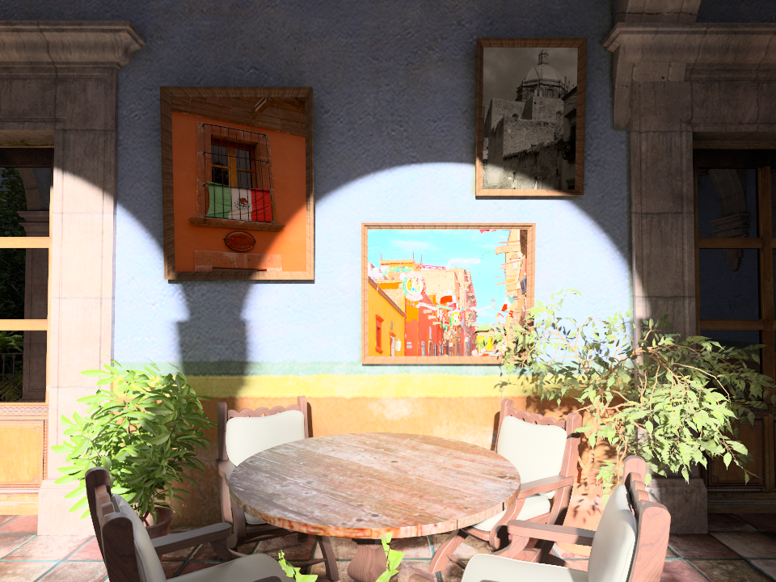

<link rel="stylesheet" href="https://cdn.jsdelivr.net/bxslider/4.2.12/jquery.bxslider.css">

Visual Computing Laboratory (VCL) mainly focuses on developing new algorithms for Computer Graphics. 
Research topics include rendering (real-time and off-line), physically-based visual simulation, animation, and fabrication.

We are always looking for highly-motivated PhD students working with us. 
If you are interested in joining our lab, please let me know.

### News
- 2024/03/25: site renewal 

###

