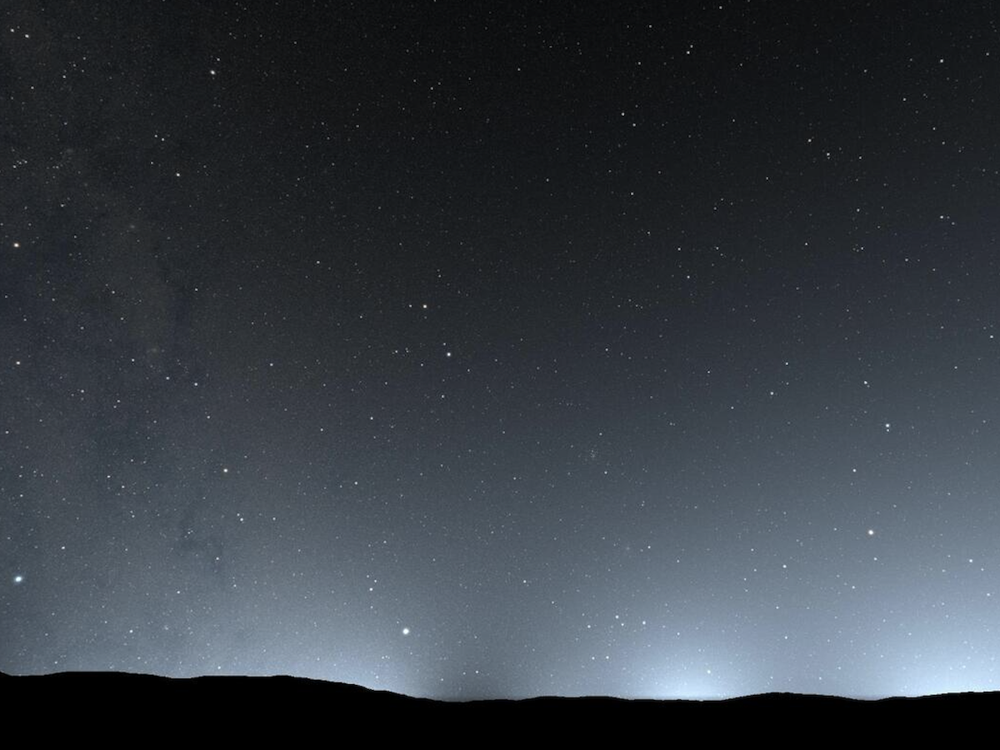

<script src="https://kit.fontawesome.com/429fe8bdbc.js" crossorigin="anonymous"></script>

### Efficient Visualization of Light Pollution for the Night Sky


#### Abstract
Artificial light sources make our daily life convenient, but cause a severe problem called light pollution. We propose a novel system for efficient visu- alization of light pollution in the night sky. Numerous methods have been proposed for rendering the sky, but most of these focus on rendering of the daytime or the sunset sky where the sun is the only, or dominant light source. For the visualization of the light pollution, however, we must consider many city light sources on the ground, resulting in excessive computational cost. We address this problem by precomputing a set of intensity distributions for the sky illuminated by city light at various locations and with different atmospheric conditions. We apply a principal component analysis and fast Fourier transform to the precomputed distributions, allowing us to efficiently visualize the extent of the light pollution. Using this method, we can achieve one to two orders of magnitudes faster computation compared to a naive approach that simply accumulates the scattered intensity for each viewing ray. Furthermore, the fast computation allows us to interactively solve the in- verse problem that determines the city light intensity needed to reduce light pollution. Our system provides the user with both a forward and inverse investigation tool for the study and minimization of light pollution.

#### Downloads
<i class="fa-solid fa-file-pdf"></i> <a href="https://dl.acm.org/doi/10.1145/3618337">paper</a> <br>
<i class="fa-solid fa-file-pdf"></i> <a href="https://dl.acm.org/doi/10.1145/3618337">supplemental document</a> <br>

#### Cite
<span style="font-size:80%;">

```bibtex
@article{10.1145/3618337,
author = {Dobashi, Yoshinori and Ishikawa, Naoto and Iwasaki, Kei},
title = {Efficient Visualization of Light Pollution for the Night Sky},
year = {2023},
issue_date = {December 2023},
publisher = {Association for Computing Machinery},
address = {New York, NY, USA},
volume = {42},
number = {6},
issn = {0730-0301},
url = {https://doi.org/10.1145/3618337},
doi = {10.1145/3618337},
journal = {ACM Trans. Graph.},
month = dec,
articleno = {219},
numpages = {11},
keywords = {fast fourier transform, light pollution, principal component analysis, the night sky}
}
```
</span>


