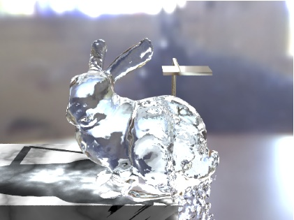
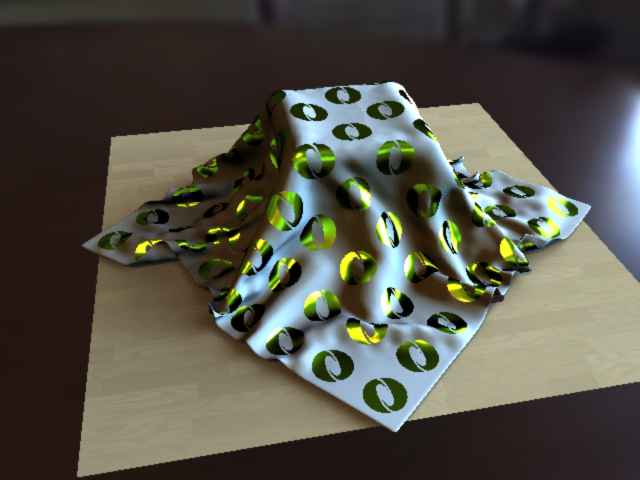
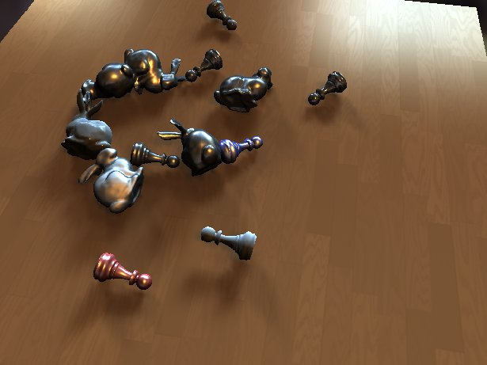
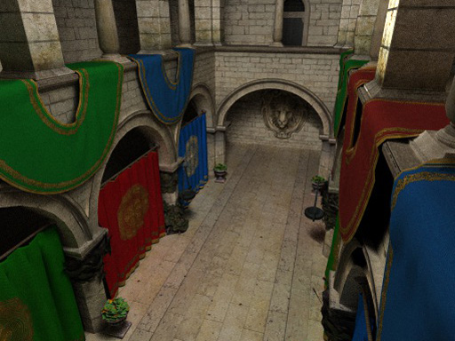
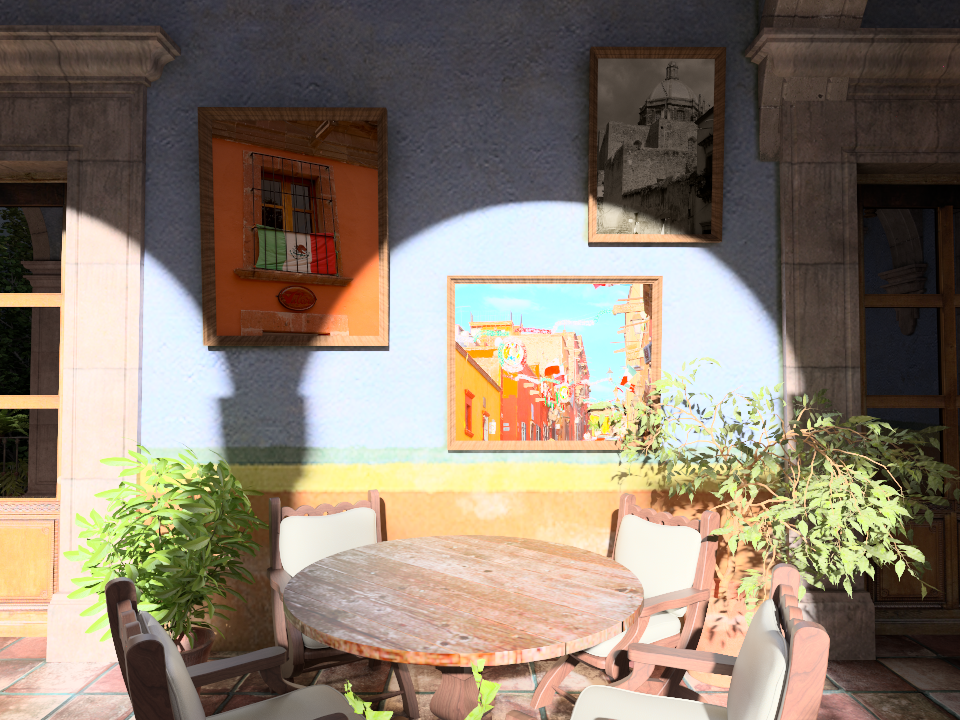
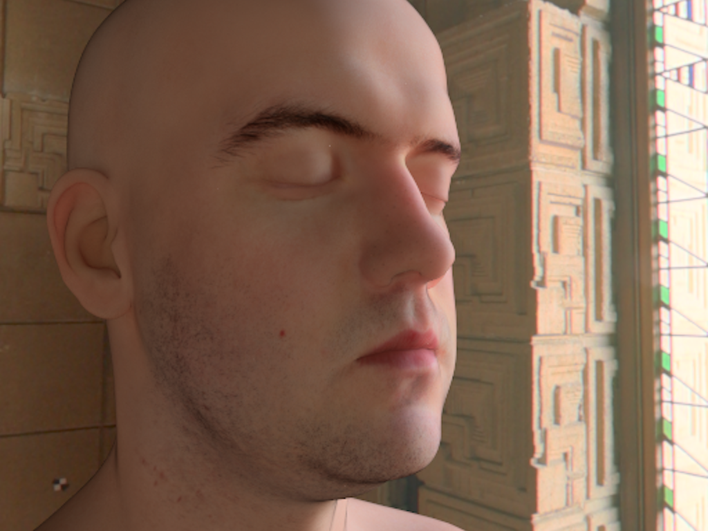
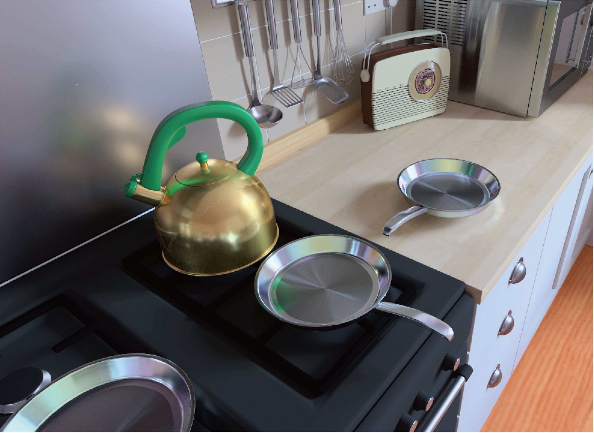

<link rel="stylesheet" href="https://cdn.jsdelivr.net/bxslider/4.2.12/jquery.bxslider.css">

ビジュアルコンピューティング研究室(VCL)は，埼玉大学 大学院理工学研究科(工学部情報工学科)に所属する研究室です．
VCLでは，コンピュータグラフィックスの研究をしています．
特に，画像生成（レンダリング），CGによる質感表現，ビジュアルシミュレーションの研究を行っています．

VCLでは博士後期課程 (Ph. D. candidate) の学生を募集しております．興味がある方は岩崎までメールでご連絡ください．
社会人博士学生も募集しております．
リサーチアシスタント(RA)としての雇用による経済的援助を用意しています．また，特別研究員の申請のお手伝いもします．
現在までの博士取得者は1名だけで，本人の優秀さに帰するところ大ですが，
在学中に特別研究員(DC2)に採用され，下記のトップレベル国際論文誌に採択されています．
- ACM Transactions on Graphics 1件
- IEEE Transactions on Visualization and Computer Graphics 1件
- Computer Graphics Forum 2件

### News
- 2024/12/06 SIGGRAPH ASIA2024のBOF「テクニカルペーパーを知る」で岩崎が発表しました．
- 2024/06/15 Nicograph International 2024でHonorable Mention Awardを受賞しました．
- 2024/06/14 Nicograph International 2024で佐藤君の研究を発表しました．
- 2024/06/05 Graphics Interface 2024で2件の発表を行いました．
- 2024/05/22 引地君の論文がGraphics Interface 2024に採択されました．
- 2024/04/01 サイトリニューアル
- 2024/03/15 全国大会でM2奥野君と中君が発表しました．
- 2023/09/18 M2高尾君がVC2023でポスター発表しました．
- 2023/06/29 M2萬谷君と岩崎がCGVI研究会で発表しました．
- 2023/04/01 埼玉大学に異動しました．

###

